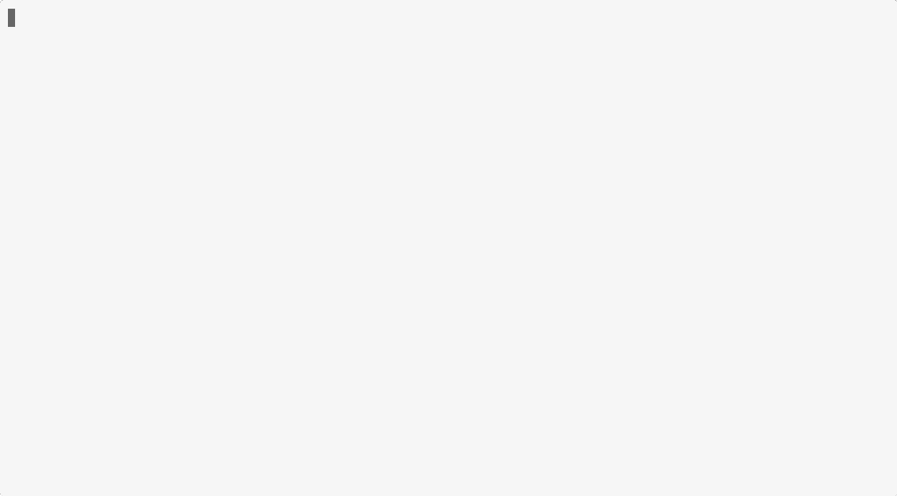

# Mantra

> **Note**: This project is currently in early development.
> It works unstable and generates poor quality code.

Mantra is an LSP-based AI-powered code generation tool for Go. It integrates with your editor to automatically implement function bodies based on developer annotations.

## Characteristics

- **Annotation-driven**: Mark functions with `// mantra: <instruction>` comments to trigger AI generation
- **LSP integration**: Works with any editor supporting the Language Server Protocol
- **Non-destructive overlays**: Generated code is presented as an overlay, preserving your original code until you explicitly apply the changes
- **Type-aware context**: Automatically collects type definitions referenced in function signatures for better generation quality
- **Checksum-based tracking**: Prevents re-generation of already-implemented functions

## Architecture

Mantra is built in Rust with the following key technologies:

- **tree-sitter**: Parses Go source code to identify annotated functions and extract type information
- **tower-lsp-server**: Provides LSP server implementation for editor integration
- **Automerge**: CRDT-based overlay system that manages generated code without modifying original files
- **External LSP server integration**: Collects context such as type definitions and symbol information from language servers (currently gopls for Go)

## License

MIT
